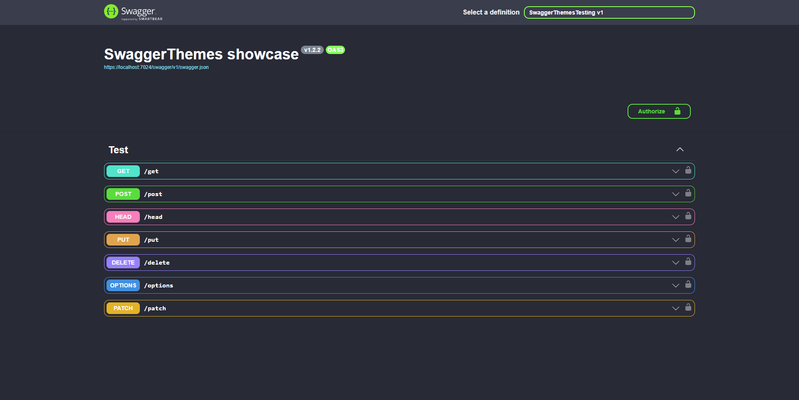
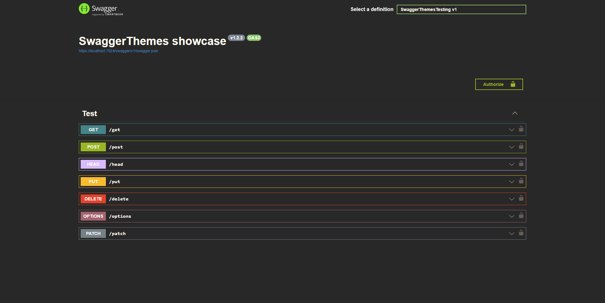
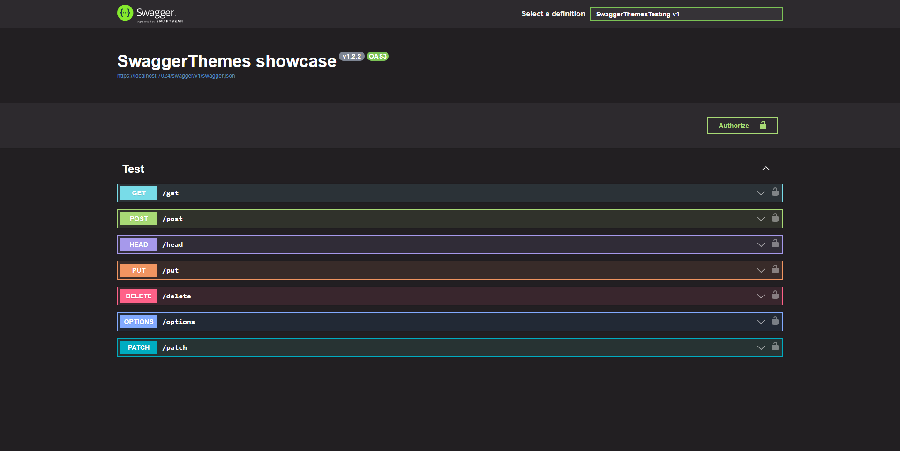
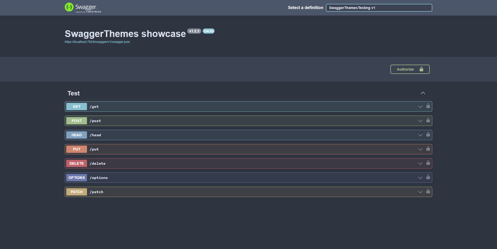
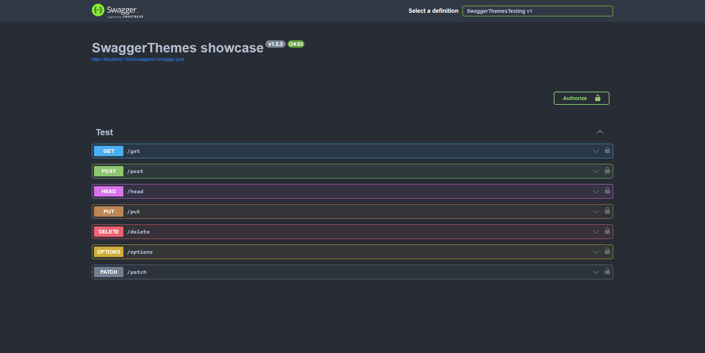
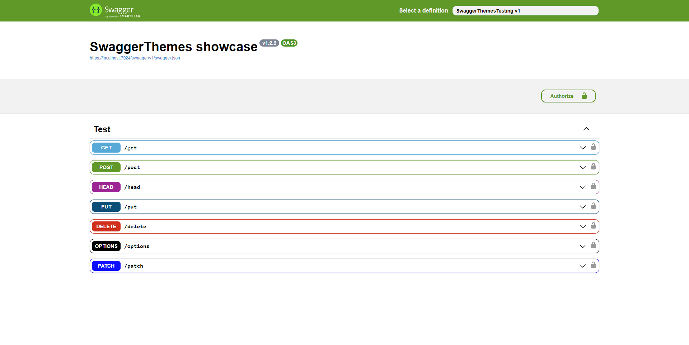

# Swagger themes

[]()
[]()

Change Swagger documentation theme easily.

## Usage

```
npm install swagger-theme-changer
```

```js
const swaggerThemes = require('swagger-theme-changer');

const theme = swaggerThemes.getTheme('universal-dark');

app.use(
    '/api-docs',
    swaggerUi.serve,
    swaggerUi.setup(
        { openapi: '3.0.0' },
        { customCss: theme }
    );
);
```

## Themes

#### Dracula



```csharp
const theme = swaggerThemes.getTheme('dracula');
```

#### Gruvbox



```csharp
const theme = swaggerThemes.getTheme('gruvbox');
```

#### Monokai



```csharp
const theme = swaggerThemes.getTheme('monokai');
```

#### Nord Dark



```csharp
const theme = swaggerThemes.getTheme('nord-dark');
```

#### One Dark



```csharp
const theme = swaggerThemes.getTheme('one-dark');
```

#### Universal Dark


```csharp
const theme = swaggerThemes.getTheme('universal-dark');
```

#### X-Code Light



```csharp
const theme = swaggerThemes.getTheme('x-code-light');
```
